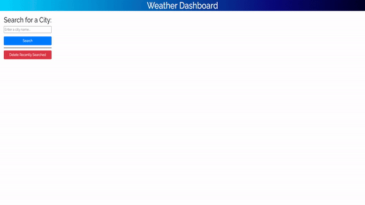

# weather-dashboard

Here is a Weather Dashboard, where you can help to use plan your travel to multiple cities and check the weather in one convenient location.

You can have up to 10 different cities saved into history, any more and they will not be saved, but you can still view the weather for that city searched.

[Click Here](https://CinosMagician.github.io/weather-dashboard) to view the live webpage

## Usage

First, enter the desired city you wish to search for into the text box. Once you have entered it in, press the 'Search' button to get the weather for that city today and the next 5 days.

Once you have searched you will city you looked at will appear as a button to the side under the 'Search' button. Clicking on a button will have the same effect as typing and searching previously.

As noted you can only save 10 cities to the history, any more will simply not appear on the list but still be searchable. If you wish to clear your history, please click on the 'Delete Recently Searched' button to clear all searched items.

Here is a demo of the site:

## License

[MIT](https://choosealicense.com/licenses/mit/)
